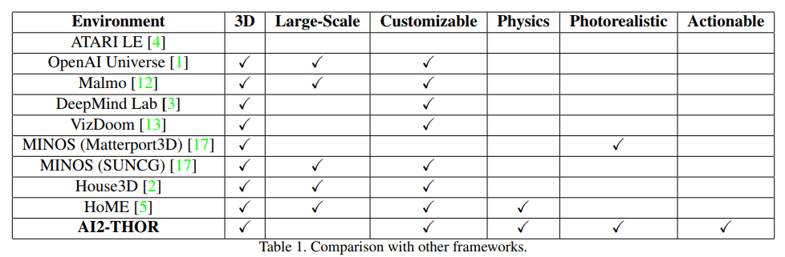

# RL-code-resources

A collection of Reinforcement Learning code resources, frameworks and environments. 
Every link below is a GitHub link so this is mainly focused on resources that are directly related to open-source code.
For other types of resources check out [awesome-rl](https://github.com/aikorea/awesome-rl), 
[spinning up](https://spinningup.openai.com/en/latest/) and our 4 hour Reinforcement Learning course we created: 
[An Introduction to Deep Reinforcement Learning](https://docs.google.com/presentation/d/1d3bxKoUn464ae_WQ2FFiFjmJPlWJI1GOydaDUAqVpJk/)

Feel free to raise issues, pull requests or email us at info@themtank.com for missing resources you think we should add. 

# RL Frameworks and design patterns
There really aren't many truly popular RL "frameworks" (i.e. the equivalent of DL frameworks 
but for RL) and there isn't even agreed upon formal design patterns/workflows that are common across all RL 
algorithm implementations. Also, the distinction between framework and "collection of algorithms" is
 hard to specify sometimes. Therefore, the below list is a mix within this continuum as well as some RL courses. 

#### PyTorch

- [pytorch-rl](https://github.com/navneet-nmk/pytorch-rl)
- [PyTorch-RL](https://github.com/Khrylx/PyTorch-RL)
- [adeptRL](https://github.com/heronsystems/adeptRL)
- [torch-rl](https://github.com/lcswillems/torch-rl)
- [torchrl](https://github.com/activatedgeek/torchrl)
- [rlkit](https://github.com/vitchyr/rlkit)
- [SLM-Lab](https://github.com/kengz/SLM-Lab)
- [tianshou](https://github.com/thu-ml/tianshou)
- [lagom](https://github.com/zuoxingdong/lagom)
- [minimalRL](https://github.com/seungeunrho/minimalRL)
- [DeepRL-Tutorials](https://github.com/qfettes/DeepRL-Tutorials)
- [ikostrikov's a3c, a2c, ppo, acktr, trpo](https://github.com/ikostrikov)
- [higgsfield's RL Adventure 1 and 2: DQN and Policy Gradient variations](https://github.com/higgsfield)
- [Deep-Reinforcement-Learning-Algorithms-with-PyTorch](https://github.com/p-christ/Deep-Reinforcement-Learning-Algorithms-with-PyTorch)
- [reinforcement-learning-algorithms](https://github.com/TianhongDai/reinforcement-learning-algorithms)
- [vel](https://github.com/MillionIntegrals/vel)
- [rl_algorithms](https://github.com/medipixel/rl_algorithms)
- [practical_RL](https://github.com/yandexdataschool/Practical_RL) but other frameworks too (TF, theano, lasagne)
- [Udacity deep-reinforcement-learning](https://github.com/udacity/deep-reinforcement-learning) 
- [simoninithomas / Deep_reinforcement_learning_Course](https://github.com/simoninithomas/Deep_reinforcement_learning_Course)
- [Deep-Reinforcement-Learning-Hands-On](https://github.com/PacktPublishing/Deep-Reinforcement-Learning-Hands-On)
- [ShangtongZhang/DeepRL](https://github.com/ShangtongZhang/DeepRL)
- [ptan](https://github.com/Shmuma/ptan)
- [autonomous-learning-library](https://github.com/cpnota/autonomous-learning-library)
- [AGNES](https://github.com/rotinov/AGNES)
- [rltime](https://github.com/opherlieber/rltime)
- [rlpyt](https://github.com/astooke/rlpyt)
- [cherry](https://github.com/learnables/cherry)
- [pytorch-madrl](https://github.com/ChenglongChen/pytorch-madrl)
- [torch_rl](https://github.com/jimimvp/torch_rl)
- [Deep_RL_with_pytorch](https://github.com/sungyubkim/Deep_RL_with_pytorch)
- [Catalyst.RL](https://github.com/catalyst-team/catalyst)
- [pg_travel](https://github.com/reinforcement-learning-kr/pg_travel)
- [spinning-up-basic](https://github.com/Kaixhin/spinning-up-basic) PyTorch version of OpenAI's spinning up
- [firedup spinning up PyTorch](https://github.com/kashif/firedup)
- [humblerl](https://github.com/piojanu/humblerl)
- [Horizon](https://github.com/facebookresearch/Horizon)

#### TensorFlow

- [OpenAI baselines](https://github.com/openai/baselines)
- [stable-baselines](https://github.com/hill-a/stable-baselines)
- [coach](https://github.com/NervanaSystems/coach)
- [yarll](https://github.com/arnomoonens/yarll)
- [acme](https://github.com/deepmind/acme)
- [dopamine](https://github.com/google/dopamine)
- [tensorforce](https://github.com/tensorforce/tensorforce)
- [trfl](https://github.com/deepmind/trfl)
- [huskarl](https://github.com/danaugrs/huskarl)
- [rl_algorithms](https://github.com/DanielTakeshi/rl_algorithms)
- [Robotics-rl-srl](https://github.com/araffin/robotics-rl-srl)
- [Tidy-Reinforcement-learning](https://github.com/sarcturus00/Tidy-Reinforcement-learning)
- [reinforcement-learning denny britz](https://github.com/dennybritz/reinforcement-learning)
- [OpenAI Spinning Up](https://github.com/openai/spinningup)
- [agents](https://github.com/tensorflow/agents)
- [tensorflow-reinforce](https://github.com/yukezhu/tensorflow-reinforce)
- [DeepRL-Agents](https://github.com/awjuliani/DeepRL-Agents)
- [anyrl-py](https://github.com/unixpickle/anyrl-py)
- [reinforcement_learning](https://github.com/yrlu/reinforcement_learning)
- [Reinforcement-learning-with-tensorflow](https://github.com/MorvanZhou/Reinforcement-learning-with-tensorflow)
- [basic_reinforcement_learning](https://github.com/vmayoral/basic_reinforcement_learning)
- [mushroom](https://github.com/AIRLab-POLIMI/mushroom)
- [reaver](https://github.com/inoryy/reaver)

#### Other

- [rllab](https://github.com/rll/rllab)
- [reinforcejs](https://github.com/karpathy/reinforcejs)
- [rlpy](https://github.com/rlpy/rlpy)
- [keras-rl](https://github.com/keras-rl/keras-rl)
- [prl](https://github.com/opium-sh/prl)
- [kerlym](https://github.com/osh/kerlym)
- [rlax](https://github.com/deepmind/rlax)
- [rl-agents](https://github.com/eleurent/rl-agents)
- [simple_rl](https://github.com/david-abel/simple_rl)
- [ShangtongZhang/reinforcement-learning-an-introduction](https://github.com/ShangtongZhang/reinforcement-learning-an-introduction)
- [reinforcement-learing implementations](https://github.com/rlcode/reinforcement-learning)
- [reinforcement-learning-kr](https://github.com/rlcode/reinforcement-learning-kr)
- [PARL](https://github.com/PaddlePaddle/PARL)
- [DeeR](https://github.com/VinF/deer)

# RL Environments

#### General collections
- [OpenAI Gym](https://github.com/openai/gym). Contains Algorithmic, Atari, box2d, classic control, 
MuJoCo, Robotics, Toy text and many more environments.
- [OpenAI Universe](https://github.com/openai/universe) which was archived and [muniverse](https://github.com/unixpickle/muniverse)
- [OpenAI Retro](https://github.com/openai/retro)
- [ml-agents](https://github.com/Unity-Technologies/ml-agents)
- [PyGame-Learning-Environment](https://github.com/ntasfi/PyGame-Learning-Environment)
- [MinAtar](https://github.com/kenjyoung/MinAtar)
- [toybox](https://github.com/KDL-umass/Toybox)
- [PCSX-Reloaded](https://github.com/pcsxr/PCSX-Reloaded/)
- [rlcard](https://github.com/datamllab/rlcard)
- [metaworld](https://github.com/rlworkgroup/metaworld)
- [open_spiel](https://github.com/deepmind/open_spiel)
- [MAMEToolkit](https://github.com/M-J-Murray/MAMEToolkit)
- [Arena-BuildingToolkit](https://github.com/YuhangSong/Arena-BuildingToolkit)

#### 3D Environments

- [CHALET](https://github.com/clic-lab/chalet)
- [House3D](https://github.com/facebookresearch/house3d)
- [ai2thor](https://github.com/allenai/ai2thor) and RoboTHOR
- [MINOS](https://github.com/minosworld/minos)
- [ViZDoom](https://github.com/mwydmuch/ViZDoom)
- [DeepMind Lab](https://github.com/deepmind/lab) and psychlab
- [HoME](https://github.com/HoME-Platform/home-platform)
- [Malmo](https://github.com/Microsoft/malmo), [marLo](https://github.com/crowdAI/marLo) and [gym-minecraft](https://github.com/tambetm/gym-minecraft)
- [AirSim](https://github.com/Microsoft/AirSim)
- [CARLA](https://github.com/carla-simulator/carla)
- [UnrealROX](https://github.com/3dperceptionlab/unrealrox), [The RobotriX](https://github.com/3dperceptionlab/therobotrix) and [gym-unrealcv](https://github.com/zfw1226/gym-unrealcv)
- [holodeck](https://github.com/BYU-PCCL/holodeck)
- [marathon-envs](https://github.com/Unity-Technologies/marathon-envs)
- [ToriLLe](https://github.com/Miffyli/ToriLLE)
- [GibsonEnv](https://github.com/StanfordVL/GibsonEnv) and [GibsonEnvV2](https://github.com/StanfordVL/GibsonEnvV2) and [iGibson](https://github.com/StanfordVL/iGibson)
- [obstacle-tower-env](https://github.com/Unity-Technologies/obstacle-tower-env)
- [DeepGTAV](https://github.com/aitorzip/DeepGTAV)
- [virtualhome](https://github.com/xavierpuigf/virtualhome)
- [deepdrive](https://github.com/deepdrive/deepdrive)
- [gym_torcs](https://github.com/ugo-nama-kun/gym_torcs)
- [neural-mmo](https://github.com/openai/neural-mmo)
- [SEVN](https://github.com/mweiss17/SEVN)
- [habitat-sim](https://github.com/facebookresearch/habitat-sim) and [habitat-api](https://github.com/facebookresearch/habitat-api)
- [angry-ai](https://github.com/mbaske/angry-ai)
- [gym-miniworld](https://github.com/maximecb/gym-miniworld)
- [gym-duckietown](https://github.com/duckietown/gym-duckietown)

#### Real Time Strategy (RTS)
- [pysc2](https://github.com/deepmind/pysc2)
- [TorchCraft](https://github.com/TorchCraft/TorchCraft), [gym-starcraft](https://github.com/alibaba/gym-starcraft) and [TorchCraftAI](https://github.com/TorchCraft/TorchCraftAI)
- [deep-rts](https://github.com/cair/deep-rts)
- [ELF](https://github.com/facebookresearch/ELF)

#### Control and robotics
- [pybullet-gym](https://github.com/benelot/pybullet-gym) and official examples at [bullet3/examples/pybullet](https://github.com/bulletphysics/bullet3/tree/master/examples/pybullet) and [pybullet_robots](https://github.com/erwincoumans/pybullet_robots) 
- [dm_control](https://github.com/deepmind/dm_control)
- [roboschool](https://github.com/openai/roboschool)
- [robosuite](https://github.com/StanfordVL/robosuite)
- [RLBench](https://github.com/stepjam/RLBench)
- [furniture](https://github.com/clvrai/furniture)
- [gym-gazebo](https://github.com/erlerobot/gym-gazebo)
- [gym-gazebo2](https://github.com/AcutronicRobotics/gym-gazebo2/tree/9f523d9d275ce7c3d002e3978eeb1d64d81cfbce)
- [cassie-rl](https://github.com/p-morais/cassie-rl) and [cassie-mujoco-sim](https://github.com/osudrl/cassie-mujoco-sim)
- [osim-rl](https://github.com/stanfordnmbl/osim-rl)
- [raisimLib](https://github.com/leggedrobotics/raisimLib)
- [morse](https://github.com/morse-simulator/morse)
- [graspit](https://github.com/graspit-simulator/graspit)
- [assistive-gym](https://github.com/Healthcare-Robotics/assistive-gym)
- [argos3](https://github.com/ilpincy/argos3)
- [rex-gym](https://github.com/nicrusso7/rex-gym)
- [jiminy](https://github.com/Wandercraft/jiminy)
- [Stage](https://github.com/rtv/Stage)
- [choreonoid](https://github.com/s-nakaoka/choreonoid)
- [Aslan](https://github.com/project-aslan/Aslan)
- [robo-gym](https://github.com/jr-robotics/robo-gym)
- [gym-saywer](https://github.com/rlworkgroup/gym-sawyer)
- [spot_mini_mini](https://github.com/moribots/spot_mini_mini)
- [webots](https://github.com/omichel/webots)
- [SenseAct](https://github.com/kindredresearch/SenseAct)
- [offworld-gym](https://github.com/offworld-projects/offworld-gym)
- [gym-electric-motor](https://github.com/upb-lea/gym-electric-motor)
- [webots](https://github.com/cyberbotics/webots)
- [gym-ignition](https://github.com/robotology/gym-ignition)
- [rl_deepracer_robomaker_coach_gazebo](https://github.com/awslabs/amazon-sagemaker-examples/tree/master/reinforcement_learning/rl_deepracer_robomaker_coach_gazebo)
- [Klampt](https://github.com/krishauser/Klampt)
- [gym-chrono](https://github.com/projectchrono/gym-chrono)
- [multiworld](https://github.com/vitchyr/multiworld)
- [autorally](https://github.com/autorally/autorally)
- [FlightGoggles](https://github.com/mit-fast/FlightGoggles)
- [v_rep](https://github.com/CoppeliaRobotics/v_rep) and [PyRep](https://github.com/stepjam/PyRep)

#### Multi-agent
- [Pommerman playground](https://github.com/MultiAgentLearning/playground)
- [MAgent](https://github.com/geek-ai/MAgent)

#### GridWorlds
- [pycolab](https://github.com/deepmind/pycolab)
- [escape_room](https://github.com/LARG/escape_room)
- [MazeBase](https://github.com/facebook/MazeBase)
- [spriteworld](https://github.com/deepmind/spriteworld)
- [gym-maze](https://github.com/MattChanTK/gym-maze)
- [gym-sokoban](https://github.com/mpSchrader/gym-sokoban)
- [mazelab](https://github.com/zuoxingdong/mazelab)
- [GridUniverse](https://github.com/TheMTank/GridUniverse) Created by us
- [gym-minigrid](https://github.com/maximecb/gym-minigrid/)

#### Other
- [hanabi-learning-environment](https://github.com/deepmind/hanabi-learning-environment)
- [bsuite](https://github.com/deepmind/bsuite)
- [XWorld](https://github.com/PaddlePaddle/XWorld) 2D+3D
- [phyre](https://github.com/facebookresearch/phyre)
- [flow](https://github.com/flow-project/flow)
- [lf2gym](https://github.com/elvisyjlin/lf2gym)
- [safety-gym](https://github.com/openai/safety-gym)
- [highway-env](https://github.com/eleurent/highway-env)
- [gym-super-mario-bros](https://github.com/Kautenja/gym-super-mario-bros) and [gym-super-mario](https://github.com/ppaquette/gym-super-mario)
- [Trading-Gym](https://github.com/thedimlebowski/Trading-Gym) and [gym-trading](https://github.com/hackthemarket/gym-trading)
- [gymfc](https://github.com/wil3/gymfc)
